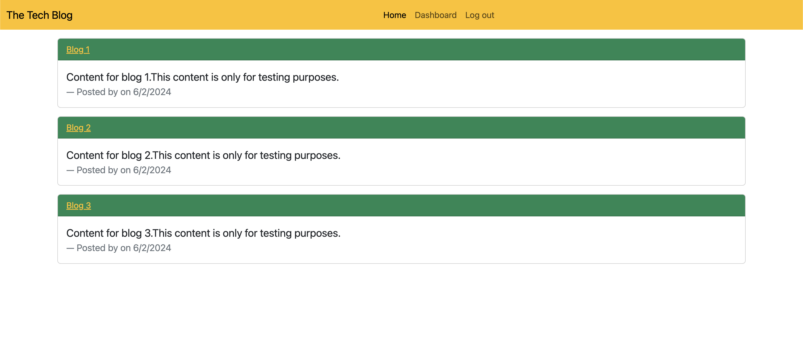
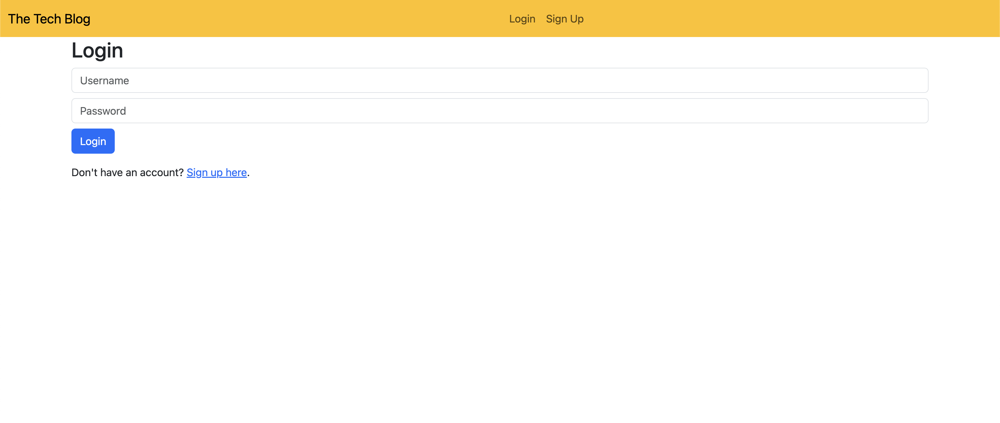

# tech-blog-mvc
## Description
* Tech Blog is a full-stack web application that allows users to create, view, and comment on blog posts. The application is built using Node.js, Express.js, Sequelize, Handlebars.js, and Bootstrap.

## Installation
* Install npm packages by running this code in the terminal ``` npm install ```
* Set up the database by runnning this code in the terminal ``` psql -U postgres ``` and enter postgres password
* Run schema sql file by running this code in the terminal ``` \i schema.sql ``` 
* Seed the database by running this code in the terminal ```npm run seed```

## Usage
* To start the application run this code in the terminal ``` npm run start```
* The server will be running at `http://localhost:3001`
* Use Insomnia or any other API client to test the API endpoints.

## Technologies Used
* Node.js
* Express.js
* Sequelize
* Dotenv
* PostgreSQL
* Handlebars
* Bootstrap

## Application Page
* 
* 

## Links
* [Github Repository](https://github.com/veyselarslan12/tech-blog-mvc)
* [Application Page](https://tech-blog-mvc-q645.onrender.com)